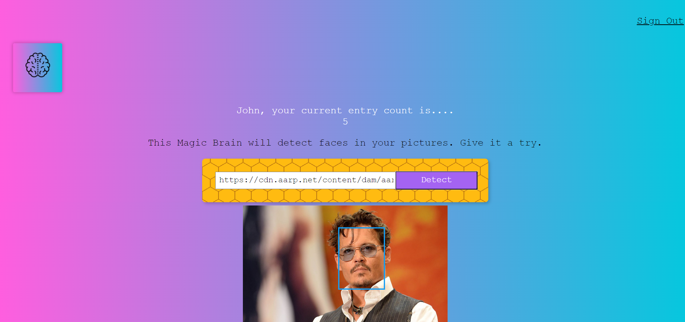

# Face Recognition Brain



The Face Recognition Brain is an innovative and cutting-edge application designed to detect faces within images using the power of face recognition technology. By providing the URL of an image, this intelligent system can accurately pinpoint and highlight faces present in the picture, revealing the individuals captured in the photograph.

# Key Features

* **Advanced Face Detection**: The Face Recognition Brain utilizes state-of-the-art face recognition algorithms to analyze images and identify faces with remarkable precision. It can detect multiple faces within a single image and mark their positions for easy identification.

* **URL-Based Image Input**: Instead of uploading images directly, users can provide a URL to the image they want to analyze. This feature offers convenience and flexibility in processing images from various sources, such as social media platforms or cloud storage.

* **Real-Time Results**: The application processes images swiftly, providing real-time results on face detection. Users receive instant feedback on the presence and location of faces, enhancing the overall user experience.

* **Intuitive User Interface**: With a user-friendly interface, the Face Recognition Brain makes it easy for individuals of all skill levels to interact with the application effortlessly. The intuitive design ensures seamless navigation and a pleasant user journey.

# How to Use

1. **Provide Image URL**: To get started, simply enter the URL of the image you want to analyze for face detection.

2. **Start Face Recognition**: Click the "Detect" or "Recognize" button to initiate the face recognition process.

3. **Analyze the Results**: The application will swiftly process the image and identify faces within it. The detected faces will be highlighted or marked, enabling easy identification.

4. **User Entry Count**: Every time you successfully detect faces in an image, your entry count will be increased, adding a fun element to your experience with the Face Recognition Brain.

# Installation and Usage Guide

# Fork the Repository

Click the "Fork" button at the top right corner of the page. This will create a copy of the repository under your GitHub account.

## Installation

To run the Project locally, follow these steps:

1. Clone the Repository

```bash
git clone https://github.com/your-username/smart-brain-frontend.git
```

2. Navigate to the project directory

```bash
cd smart-brain-frontend
```

3. Install the dependencies using npm

```bash
npm install
```

## Usage

To start the development server and view the application, run the following command:

```bash
npm start
```

This will start the application on your computer's local development server, accessible at [http://localhost:3000](http://localhost:3000).